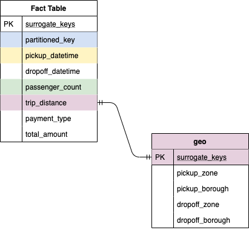

# Data Engineering Capstone Project Write Up
---

## Project Summary
---

The goal of this project is to create an ETL pipeline to build a single source-of-truth database with all the the yellow taxi trip record provided by the NYC Taxi and Limousine Commission (TLC). This represent 10 years of data, billions of rows, multiple data models. This data set is growing every month as TLC Trip Record Data are updated on regular basis.

## Data Source
---

### Main Data Source Description 

The data are accessible from multiple sources. For this project I chose to access them from the The Socrata Open Data API (SODA). I chose SODA especially because it allowed me to break down this data in small chunck with a lot of flexibility. 

### Detailed Main Data Source Tables:
| Data Set Name | Public Page | API endpoint | Rows | Columns
| ------- | ---------- | ----------- | ---- | ------- |
| 2018 Yellow Taxi Trip Data  | https://data.cityofnewyork.us/Transportation/2018-Yellow-Taxi-Trip-Data/t29m-gskq | https://data.cityofnewyork.us/resource/t29m-gskq.json | 112M | 17
| 2017 Yellow Taxi Trip Data  | https://data.cityofnewyork.us/Transportation/2017-Yellow-Taxi-Trip-Data/biws-g3hs | https://data.cityofnewyork.us/resource/biws-g3hs.json | 112M | 17
| 2016 Yellow Taxi Trip Data  | https://data.cityofnewyork.us/Transportation/2016-Yellow-Taxi-Trip-Data/k67s-dv2t | https://data.cityofnewyork.us/resource/uacg-pexx.json | 112M | 17
| 2015 Yellow Taxi Trip Data  | https://data.cityofnewyork.us/Transportation/2015-Yellow-Taxi-Trip-Data/ba8s-jw6u | https://data.cityofnewyork.us/resource/2yzn-sicd.json | 112M | 17
| 2014 Yellow Taxi Trip Data  | https://data.cityofnewyork.us/Transportation/2013-Yellow-Taxi-Trip-Data/7rnv-m532 | https://data.cityofnewyork.us/resource/gkne-dk5s.json | 112M | 17
| 2013 Yellow Taxi Trip Data  | https://data.cityofnewyork.us/Transportation/2018-Yellow-Taxi-Trip-Data/t29m-gskq | https://data.cityofnewyork.us/resource/t7ny-aygi.json | 112M | 17
| 2012 Yellow Taxi Trip Data  | https://data.cityofnewyork.us/Transportation/2012-Yellow-Taxi-Trip-Data/fd5y-xikb | https://data.cityofnewyork.us/resource/kerk-3eby.json | 112M | 17
| 2011 Yellow Taxi Trip Data  | https://data.cityofnewyork.us/Transportation/2011-Yellow-Taxi-Trip-Data/jr6k-xwua | https://data.cityofnewyork.us/resource/uwyp-dntv.json | 112M | 17
| 2009 Yellow Taxi Trip Data  | https://data.cityofnewyork.us/Transportation/2009-Yellow-Taxi-Trip-Data/f9tw-8p66 | https://data.cityofnewyork.us/resource/f9tw-8p66.json | 112M | 17

### 2018 Yellow Taxi Trip detailed

Here is an example of what a single trip looks like:	

`
{
  "vendorid":2, //Number
  "tpep_pickup_datetime":"2084 Nov 04 12:32:24 PM", //Date & Time
  "tpep_dropoff_datetime":"2084 Nov 04 12:47:41 PM",	 //Date & Time
  "passenger_count":1,	 //Number
  "trip_distance":1.14,	 //Number
  "RatecodeID":1,	//Number
  "store_and_fwd_flag":"N",	//Plain Text
  "PULocationID	":"238", //Plain Text
  "DOLocationID":"236", // Plain Text
  "payment_type":2, //Number
  "fare_amount":10, //Number
  "extra":0, //Number
  "mta_tax":0.5, //Number
  "tip_amount":0, //Number
  "tolls_amount":0, //Number
  "improvement_surcharge":0.3, //Number
  "total_amount":10.8 //Number
}
`

### Additional Data Source

nyc_taxi_zones

| Columns |
| ------- |
| OBJECTID  | 
| Shape_Leng  | 
| the_geom |
| Shape_Area |
| zone |
| LocationID |
| borough |

I used this small data set to unify New York Pickup and Dropoff Area accross all the trips recorded. 

`
{
  "OBJECTID":1, //INTEGER
  "Shape_Leng":0.116357453189, //FLOAT
  "the_geom":"MULTIPOLYGON (((-74.18445299999996 40.694995999999904, -74.18448899999999 40.69509499999987, -74.18449799999996 40.69518499999987, -74.18438099999997 40.69587799999989, -74.18428199999994 40.6962109999999, -74.18402099999997 40.697074999999884, -74.18391299999996 40.69750699999986, -74.18375099999997 40.69779499999988, -74.18363399999998 40.6983259999999, -74.18356199999994 40.698451999999875, -74.18354399999998 40.69855999999988, -74.18350799999996 40.69870399999992, -74.18327399999998 40.70008999999988, -74.18315699999994 40.701214999999884, -74.18316599999997 40.702384999999886, -74.18313899999998 40.7026279999999, -74.18309399999998 40.7028529999999, -74.18299499999995 40.70315899999985, -74.18284199999994 40.70346499999989, -74.18264399999998 40.70373499999988, -74.18242799999996 40.70395099999992, -74.18220299999996 40.704139999999896, -74.18203199999994 40.70425699999987, -74.18180699999994 40.7043919999999, -74.18157299999996 40.70449999999988, -74.18132099999997 40.70460799999991, -74.18080799999996 …",	 //STRING
  "Shape_Area":0.0007823067885,	 //FLOAT
  "zone":"Newark Airport", //STRING
  "LocationID":1,	//INTEGER
  "borough":"EWR" //STRING
}
`

Based on main data set output, pickup and dropoff zone are join based on LocationID or geom. 

## Data Sources Challenges
---

There was one main challenge related to the data source:

- Data Schema isn't well documented and some columns are changing over time. Some columns are renamed, some columns are deleted and replaced by others.

This main challenge lead me to other smaller challenges:

- Find a way to ingest all the data on daily basis without having to do any cleaning operation to ensure the quality of the ingestion. 
- Clean the data set to be able to build a source-of-truth database.

## Repository overview
---

### files:
* *elt.py* : extract, transform, load dag 
* *SocrataToGCSOperator.py* : Custom operator to query Socrata API and pass result to Google Cloud Storage.
* *SocrataQueryOperator.py* : Custom operator to query Socrata API with customised query.
* *DataQualityOperator.py* : Custom oerator to run queries and test data quality.

### sql queries
* *api_params.sql*: Templated query to filter desired output from Socrata API 
* *bad_rows.sql*: Templated query to pass bad rows from raw data table to bad row table. 
* *coordinate.sql*: Templated query to join geopoint data from raw data table with NYC taxi zones borough from Public NYC taxi zones table
* *create_bad_row_table.sql*: create bad row table 
* *create_fact_table.sql*: create fact table
* *create_geo_table.sql*: create geo table
* *create_summary_table.sql*: create summmary table
* *fact_query.sql*: Templated query to insert data from raw table into fact table
* *insert_key.sql*: Templated query to insert surrogate_keys into raw data table
* *location.sql*: Templated query to join LocationID data from raw data table with NYC taxi zones borough from Public NYC taxi zones table
* *quality_check.sql*: Templated query to count number of rows
* *quality_check_duplicate.sql*: Templated query to check for duplicate
* *summary.sql*: Templated query to insert summary data ready for analysis. 
* *total_record.sql*: Template query to count the number of rows from API call

## Project specifications
---

Data are loaded retroactively ("backfilled") on daily basis and per pagination as csv file into Google Cloud Storage. From there, csv files are imported into a staging environement in Big Query where raw data format (and schema) is conserved. From the staging table, columns consistent enough over time to build a single source-of-truth database are passed into a production table (in BigQuery too). 

* Socrata API request is paginated. Each pagination result is passed as a seperate csv file in Google Cloud Storage.
* Socrata API request is filtered using SQL.
* Data transformation is done with sql queries on BigQuery.
* Transformed data are sent to a production table following a model that helped me to more easily build a single source-of-truth database. 
* Data type are handle with predefined JSON schema to enfore consistency. 
* Data Quality test and check ensure that every raw from the API call are passed in staging. 

## Project rationale
---

### Airflow

Airflow was the best option to move such big amount of data. Some core concept helped us to make our choice:

Load data incrementally: As the NYC Yellow taxi cab entire data set is pretty big and spread out over 10 years of data I need a way to break it down into small chunk and load data incrementally. 

Process historic data: Airflow is specifficaly designed historical data by giving the possibility of back-filling data way back to the start date. 

Partition ingested data: Building the pipeline with Airflow was easy to partitioned data by date allowing us to more easily audit ETL process and optimise query performances. 

Enforce deterministic properties: A function is said to be deterministic if for a given input, the output produced is always exactly the same. Examples of cases where behavior of a function can be non-deterministic:

Execute conditionally: As data schema was complexe to handle (different for one year of data to another year) BranchPythonOperator allowed us to run different query with multiple path based on different data schema. 

Rest data between tasks: This concept allowed us to build a reliable and tracable data piple. Data are stored at each step of their transformation. If anything is wrong, issues can be traced back throught log and table inspection. 

### GCP

I've experienced multiple cloud platform environement (Google, Amazon, Microsoft). For this project they all seems to be identical. I chose to work with the environement with which I had most familiarity. 

## Data model
---

### Description

The database schema used in this project is the Star Schema. One table (fact table) contains all the measures of each events. 1 dimension tables contain dimension of measures in the Fact table. Each dimension table is linked to the fact table with their surrogate_keys.

Step 3: Define the Data Model

Map out the conceptual data model and explain why you chose that model
List the steps necessary to pipeline the data into the chosen data model

### Advantage of Star Schema

Here are the main benefits of Star Schema:
* Simplified Queries - join logic are simpler with Star Schema.
* Query Performances - Read-only is easier as compared to normalized schemas
* Simplified business reporting logic 
* Fast aggregations 

### Detailed Structure

#### Fact Table

##### songplays

records in log data associated with song plays i.e. records with page NextSong

| Columns      | Constraints   | Type  | 
| ------------ | ------------- | ----- |
| surrogate_keys | PRIMARY KEY NOT NULL | SERIAL
| partitioned_key | REFERENCES time(start_time) | TIMESTAMP
| pickup_datetime | REFERENCES users(user_id) | VARCHAR
| passenger_count | no constraints | VARCHAR
| trip_distance | REFERENCES songs(song_id) | VARCHAR
| payment_type | REFERENCES artists(artist_id) | VARCHAR
| total_amount | no constraints | INT

#### Dimension Tables

##### users

Users in the app

Columns      | Constraints   | Type  | 
------------ | ------------- | ----- |
surrogate_keys | PRIMARY KEY NOT NULL | VARCHAR
pickup_zone | no constraints | VARCHAR
pickup_borough | no constraints | VARCHAR
dropoff_zone | no constraints | VARCHAR
dropoff_borough | no constraints | VARCHAR

## ELT Process 
---

### Extract

Data are extracted from Socrata API and loaded into Google Cloud Storage bucket as csv file. all the data are stored into a root folder named "data". Inside this folder data are loaded following the folder structure Year / Month / Day. In the day folder each data per pagination (API call) 

### Load

Raw data are loading into a staging environement. The staging table is flexible allowing any data schema change and update. A surrogate key is added. 

### Transform

Data from raw table are selected to fit a common schema in a production environement. Geopoint data and locationID are transformed to bourough to fit common language. 

## Update data set

Data can be upated as soon as new data are available. However data are made available usually over a month or 6 months period, which mean that daily data should be ingested backfilled. And again here is using the Socrate API it is best to chose daily backfill update to ensure consistency, reliabibly and respect the Airflow concepts and phylisophy. 

